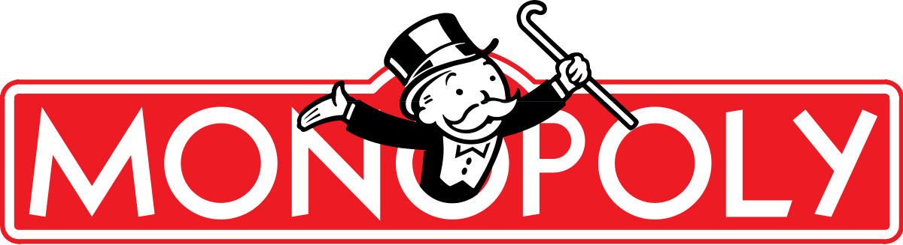
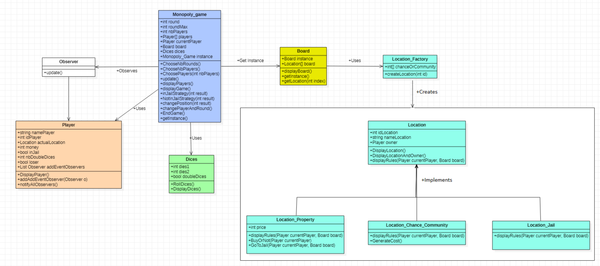

# Monopoly

**Date de réalisation :** Janvier 2020

**Cadre du projet :**  Cours "Design Pattern & Software Development Process" en 4ème année à l’ESILV (2ème année du cycle ingénieur), réalisé en binôme avec Nicolas

**Langage utilisé :** C#

<p>
 
</p>

## Présentation du projet
Il s’agit d’une version simplifiée du Monopoly, réalisé à l’aide d’un projet Console sur VisualStudio. Il a été implémenté en utilisant divers design patterns (modèles de conception).

Il est joué à l’aide d’un plateau circulaire, possédant 40 positions. Chaque position possède ses propres caractéristiques comme son type (propriété à acheter, carte à piocher (CHANCE ou COMMUNAUTE), prison), un identifiant… De plus, le jeu est joué avec deux dés, qui sont simulés.

## Design Hypotheses
Une liste de règles à respecter nous était donnée. Elles concernaient principalement les actions à suivre lorsqu’un joueur obtient deux dés identiques ou est en prison. Nos hypothèses de conception sont les suivantes :

- A propos des positions sur le plateau :

Il y a 40 cases. Grâce au *Factory pattern*, nous avons créé différents types de cases :

•	**Case 0 : DEPART**

C’est la position occupée par tous les joueurs en début de partie. Si un joueur passe par cette case, il reçoit 200€.

•	**Case 10 : VISIT ONLY / IN JAIL**

Un joueur est en prison s’il a atterri au préalable sur la case 30 ou s’il a obtenu des doubles en jetant les dés 3 fois d’affilée.
Pour en sortir, il doit réaliser un double avec les dés ou bien rater cela 3 tours d’affilée.

•	**Case 30 : GO TO JAIL**

Le joueur doit aller directement en prison et ne reçoit pas les 200€ de la case départ. 

•	**Cases 2, 7, 17, 22, 33, 36 : CHANCE / COMMUNITY**

Le joueur pioche une carte, qui peut lui faire gagner ou perdre de l’argent (valeur aléatoire entre 100, 200, 500 et 100€).

•	**Autres cases : PROPRIETE** 

Ces cases ont un autre attribut : un prix. En effet, un joueur peut être le propriétaire s’il paye pour cela quand il arrive sur cette case. Le prix d’une case est donné par la formule suivante : identifiant de la case * 50.
Ensuite, si un autre joueur tombe sur cette case, il doit donner de l’argent au propriétaire (prix de la propriété / 10). Ce n’est pas possible de vendre une propriété à la banque ou à un autre joueur. Une fois qu’un joueur a payé pour une propriété, il reste son propriétaire jusqu’à la fin de la partie (par soucis de simplicité).

- A propos des règles pour finir la partie :

Au début du jeu, le nombre maximal de tours à jouer est demandé, sachant qu’un tour correspond au fait que chaque joueur a joué une fois (a lancé les dés une fois). Après avoir joué ce nombre de tours, le jeu prend fin et le gagnant est celui qui possède le plus d’argent.
Le jeu peut également prendre fin d’une autre manière : lorsqu’un joueur doit de l’argent à un autre mais qu’il n’a pas les moyens de payer. 

**Diagramme de classe**

<p align="center">
 
</p>

**Diagramme séquence**

Le diagramme séquence est situé dans le dossier images. La structure globale du jeu y est représentée : les différentes boucles et parties du jeu. Dans cet exemple, le joueur est situé sur la case DEPART, et lances les dés. Il n’est pas en prison donc nous utilisons la NotInJailStrategy. Il arrive sur une propriété donc les règles de cette case sont affichées et nous lui demandons s’il souhaite acheter cette propriété (car elle n’a pas encore de propriétaire). Il répond oui donc nous regardons s’il possède assez d’argent, c’est le cas donc il devient le propriétaire. Il n’a pas obtenu un double en lançant les dés donc il ne peut pas rejouer. C’est au joueur suivant de jouer. Le tour change car le joueur précédent était le dernier du tour à jouer.


## Structure des fichiers

Le projet comporte 11 classes : Board, Dices, Location, Location_Chance_Community, Location_Factory, Location_Jail, Location_Property, Monopoly_Games, Observer, Player et Program.

Le Program.cs contient tous les tests du jeu.

Si le projet Visual Studio se nomme Monopoly, il suit donc cette structure :

```dir
│___Monopoly
│       bin
│       obj
│       Properties
│       App.config
│       Board.cs
│       Dices.cs
│       Monopoly.csproj
│       Location.cs
│       Location_Chance_Community.cs
│       Location_Factory.cs
│       Location_Jail.cs
│       Location_Property.cs
│       Monopoly_Game.cs
│       Observer.cs
│       Player.cs
│       Program.cs
│
└───Monopoly.sln
```
